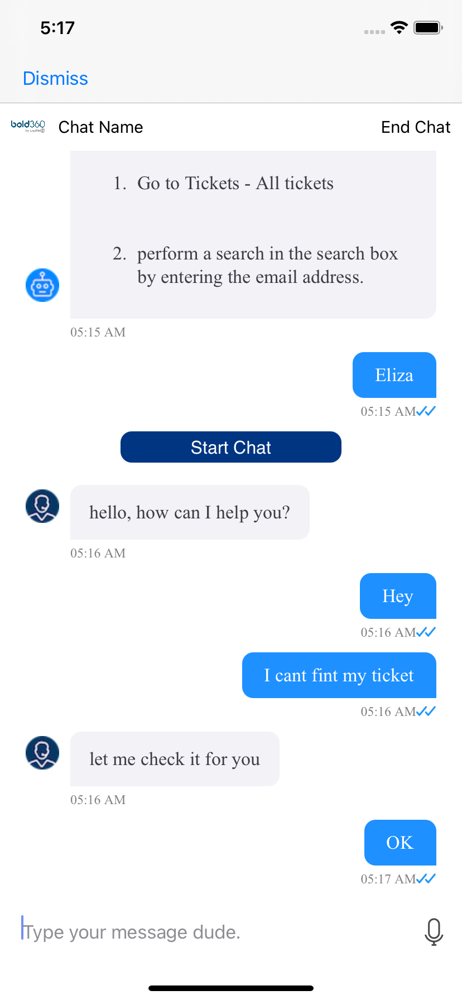
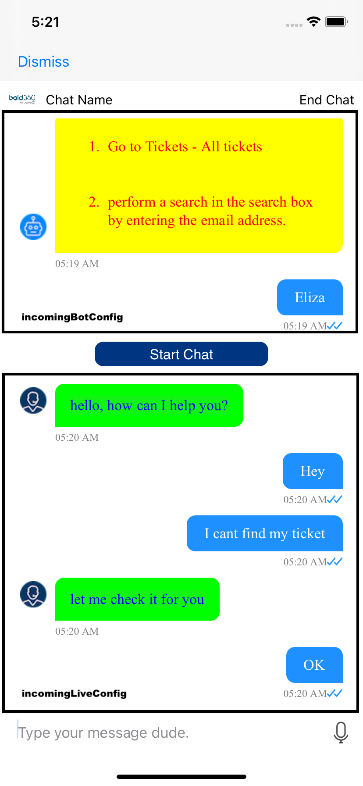
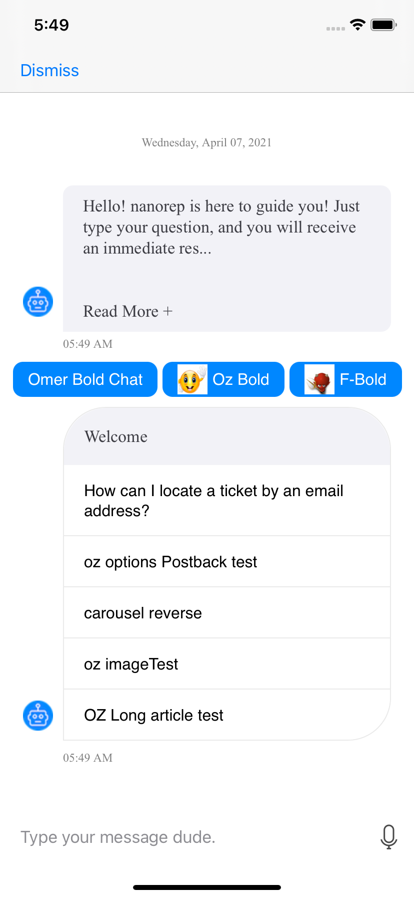
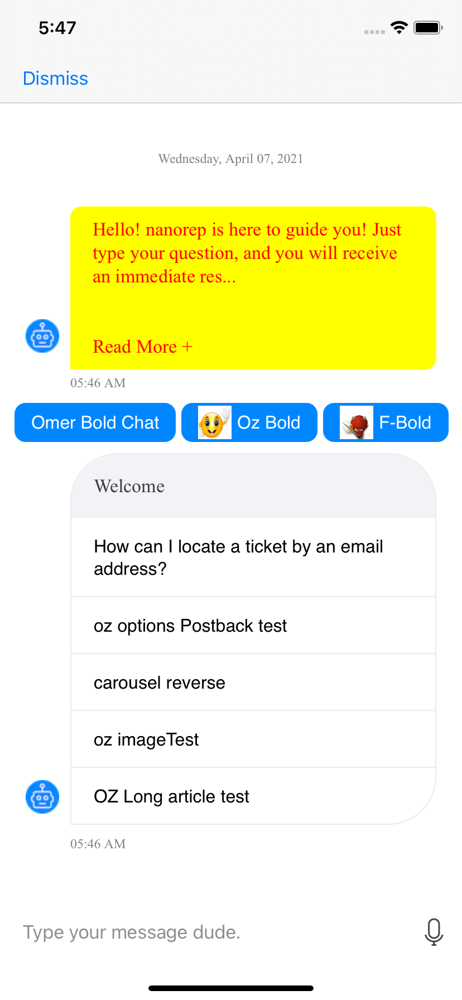
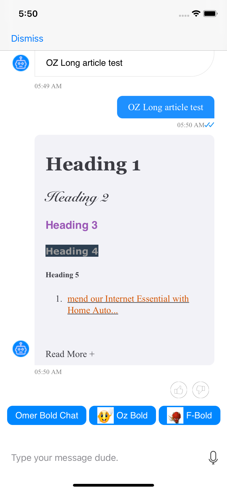
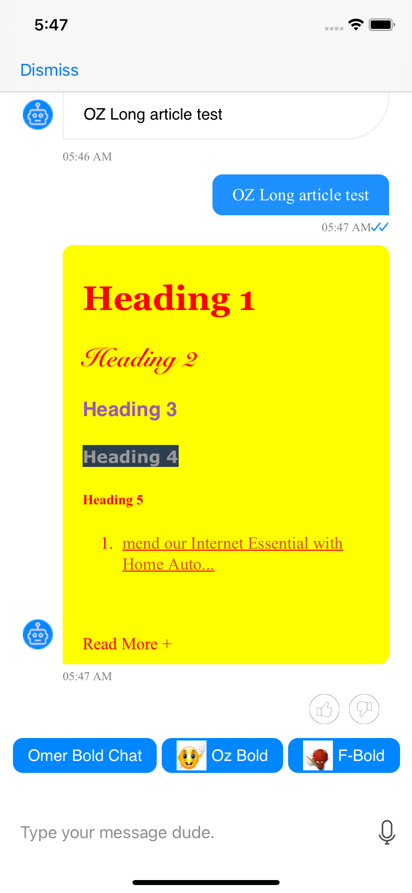

# Incoming message 
{: .no_toc}

## Table of contents 
{: .no_toc .text-delta }

- TOC
{:toc .mb-0}
- [Message options](./incoming-options)
- [Feedback]({{ '/docs/advanced-topics/feedback' | relative_url }})
- [Carousel](./carousel)
- [Message Injection]({{ '/docs/advanced-topics/messages-injection/#how-to-inject-messages' | relative_url }})

---

## Overview
The chat partner(chatbot, agent) side messages.   
Displays textual and HTML formatted messages.
The incoming message component also supports the display of avatar image and timestamp. 
{: .overview}

Chatbot messages may be constructed by multiple UI components, depends on the message content.
The incoming message component contains the textual content of the message, persistent options, readmore.
Other message properties such channels quick options and feedback, are displyed by separate components. 

---

## How to customize
The incoming message component supports many customizatins.
> To see all supported configuration open `IncomingMessageConfiguration`.

The default configuration can be changed via 
* `ChatController.viewConfiguration.incomingBotConfig`  
* `ChatController.viewConfiguration.incomingLiveConfig`

```swift
lazy var chatConfig = { () -> Bold360AI.ChatConfiguration in
        var config = Bold360AI.ChatConfiguration()
        return config
    }()

    func updateBotIncoming() {
        self.chatConfig.incomingBotConfig.backgroundColor = UIColor.yellow
        self.chatConfig.incomingBotConfig.textColor = UIColor.red
    }

    func updateLiveIncoming() {
        self.chatConfig.incomingLiveConfig.backgroundColor = UIColor.green
        self.chatConfig.incomingLiveConfig.textColor = UIColor.blue
    }
```

### Before & After

| Before                                                                                          | After                                                                                          |
|-------------------------------------------------------------------------------------------------|------------------------------------------------------------------------------------------------|
|  |  |

---

## Readmore component on long chatbot messages
Chatbot messages content display has a length limit, called <u>threshold</u>. Messages that are longer than the configured threshold length, will be trimmed.   
A `readmore` component will appear on the bottom of a trimmed message, leading to a full message view.   
{: .overview}

The `readmore` component supports configuration under `incomingBotConfig`.

```swift
    func updateBotIncoming() {
        self.chatConfig.incomingBotConfig.backgroundColor = UIColor.yellow
        self.chatConfig.incomingBotConfig.textColor = UIColor.red
    }
```

### Before & After

|                    | Before                                                                                           | After                                                                                           |
|--------------------|--------------------------------------------------------------------------------------------------|-------------------------------------------------------------------------------------------------|
| Standard Read More |   |   |
| Styled Read More   |  |  |

### Customizing chatbot message length display
By default the threshold is configured to limit the text length to 320 characters.   
The threshold can be configured to different value.

>Works only for `incomingBotConfig`.

```swift
    func updateBotIncoming() {
        self.chatConfig.incomingBotConfig.maxLength = 100
    }
```
